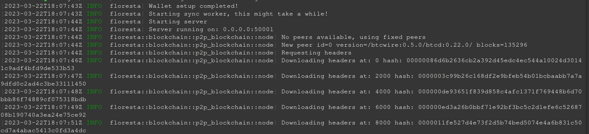

## Tutorial

### Introdução

Este programa é uma pequena implementação de node com um Electrum Server acoplado. Ela se comporta semelhante a um setup com Bitcoin Core + Electrum Personal Server, porém com algumas diferenças chave.  

- Node e Electrum Server estão no mesmo binário, tornando o processo mais simples e com menos erros.
- O full node utiliza uma tecnologia nova chamada `Utreexo` para reduzir o consumo de recursos, você consegue rodar o node com menos de 1GB de disco e RAM.
- Diferentemente do EPS, esse Electrum Server suporta múltiplas conexões simultâneas.

### Utilizando

Existem duas maneiras de se obter o executável. Você pode compilar do código-fonte ou baixar o binário pré-compilado do Github. Para intruções de como compilar o código-fonte, [veja abaixo](#compilando). As informações de como rodar estão [aqui](#rodando)

### Compilando

Para compilar, você precisa da toochain do Rust e o Cargo, mais informações [aqui](https://www.rust-lang.org/).
Você pode obter o código-fonte baixando do Github ou clonando com

```bash
git clone https://github.com/Davidson-Souza/Floresta.git
```

Navegue para dentro da pasta com

```bash
cd Floresta/
```

compile com:

```bash
cargo build --release
```

se tudo estiver ok, irá compilar o programa e salvar o executável em `./target/release/`.

### Rodando

Antes de rodar ele pela primeira vez, você precisa extrair a xpub da sua carteira. Na Electrum, basta ir no menu "Carteira" e clicar em "Informações", a xpub vai aparecer em uma caixa de texto grande.

Uma vez que você tenha a Chave Pública Extendida em mãos, copie o arquivo de configuração `config.toml.sample` para `config.toml` edite-o inserindo a xpub no campo apropriado. Você pode inserir infinitas xpubs. Também é permitido endereços soltos.

Para endereços multisig, uma carteira como Sparrow é recomendada. Basta copiar o "output descriptor" gerado pela mesma.

Veja [abaixo](#config_example) um exemplo de arquivo válido.

```bash
floresta -c config.toml --network signet run
```

ou

```bash
./target/release/floresta -c config.toml --network signet run
```

ou

```bash
cargo run --release -- -c config.toml --network signet run
```

Onde:

- `network` é a rede que você está utilizando, bitcoin significa mainnet, outros valores válidos são signet, regtest e testnet. Todas são redes de teste que são funcionalmente idênticas a rede principal (mainnet), porém utilizada apenas para teste, e suas moedas não tem valor algum.

Se tudo der certo, ele irá iniciar a sincronização e mostrar o progresso na tela. A partir do momento em que aparecer
> Server running on: 0.0.0.0:50001

você já poderá conectar a sua carteira ao servidor, porém o saldo poderá demorar um pouco para aparecer.

#### Exemplo de arquivo de configuração {#config_example}

```toml
[wallet]
xpubs = [
    "vpub5ZkWR4krsAzwFsmW8Yp3eHuANVLr7ZSWii6KmRnLRiN6ZXLbqs1f217jJM37oteQoyng82yw44XQU8PYJJBGgVzvJ96dQZEyZZcDiDmoJXw",
    "vpub5V5XF4ipcQ9tLp7NCFswnwZ23tm5Key81E9CCfqFXaGjzTpQ8jjiirf2hG7aXtqXbRDFxMvEhdGdeFcqQ3jUGUkq4mqo2VoGCDWCZvPQvUy",
]
addresses = [
    "tb1qjfplwf7a2dpjj04cx96rysqeastvycc0j50cch"
]
descriptors = [
    "wsh(sortedmulti(1,[54ff5a12/48h/1h/0h/2h]tpubDDw6pwZA3hYxcSN32q7a5ynsKmWr4BbkBNHydHPKkM4BZwUfiK7tQ26h7USm8kA1E2FvCy7f7Er7QXKF8RNptATywydARtzgrxuPDwyYv4x/<0;1>/*,[bcf969c0/48h/1h/0h/2h]tpubDEFdgZdCPgQBTNtGj4h6AehK79Jm4LH54JrYBJjAtHMLEAth7LuY87awx9ZMiCURFzFWhxToRJK6xp39aqeJWrG5nuW3eBnXeMJcvDeDxfp/<0;1>/*))#fuw35j0q"
]
```

#### Print do programa em execução


